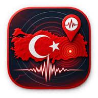

<p align="center">
  
</p>

<h1 align="center">Zelzele</h1>

<p align="center">
  Türkiye'deki depremleri harita üzerinde takip eden, telefonda ve bilgisayarda
  çalışan bir uygulama.<br>
  Veri <b>AFAD</b> ve <b>Kandilli Rasathanesi</b>'nden gelir.
</p>

<p align="center">
  <a href="https://kamilsaim.github.io/zelzele/"><b>kamilsaim.github.io/zelzele</b></a>
</p>

## Ne yapar

- **Özet ekranı** — açılışta son deprem, günün rakamları ve çevrendekiler tek bakışta
- **Harita** — depremler büyüklüğe göre boyutlanır ve renklenir, son 30 dakikadakiler yanıp söner
- **Isı haritası** — depremlerin nerede yoğunlaştığını gösterir; fay zonları kendiliğinden ortaya çıkar
- **Liste ve filtre** — zaman aralığı, en az büyüklük, yer/il araması, en yeni / en büyük / en yakın sıralaması
- **Analiz** — zaman dağılımı, en sık deprem olan iller, büyüklük ve derinlik dağılımı, en büyük depremin artçıları
- **Konum** — izin verirsen depremlerin sana uzaklığını hesaplar
- **Arka plan bildirimi** — uygulama kapalıyken de bildirim. Üç kural: Türkiye geneli eşiği,
  yakınımdaki depremler (yarıçap), takip ettiğim şehirler
- **Şehir takibi** — 81 ilden seçtiklerinde deprem olduğunda haber verir
- **Ayrıntı sayfası** — koordinat, ölçek, artçılar ve paylaşma; telefonda geri tuşuyla kapanır
- **PWA** — ana ekrana eklenir, tam ekran açılır, internetsizken son veriyi gösterir

Telefonda alt menüyle beş ekran arasında geçilir (Özet, Harita, Liste, Analiz, Ayarlar);
bilgisayarda harita solda kalır, aynı ekranlar sağ panelde sekme olur.

## Veri nereden geliyor

Üç kaynak paralel denenir, hangisi yanıt verirse veri ondan gelir; ikisi de tutarsa
kayıtlar birleştirilip aynı deprem tekilleştirilir (90 sn / 20 km / 1.0 büyüklük eşiği).

| Kaynak | Nasıl | Not |
|---|---|---|
| `data/latest.json` | Aynı origin, her zaman çalışır | GitHub Actions 5 dakikada bir tazeler |
| AFAD `apiv2` | Tarayıcıdan doğrudan | CORS'a takılırsa sessizce atlanır |
| Kandilli aynası | Topluluk proxy'si | Ayna kapanırsa sessizce atlanır |

Yani canlı uçlar çalıştığında anlık, çalışmadığında en fazla birkaç dakika gecikmeli
veri görürsün. Uygulama hiçbir durumda boş kalmaz.

`.github/workflows/update-data.yml` `scripts/fetch-quakes.mjs`'i çalıştırır: AFAD'ın
JSON ucundan ve KOERI'nin metin listesinden son 30 günü çeker, birleştirir,
`data/latest.json`'a yazar ve değişiklik varsa commit'ler.

## Telefonda kullanma

**iOS:** Safari'de siteyi aç → Paylaş → *Ana Ekrana Ekle*. Arka plan bildirimi iOS'ta
**yalnızca** böyle kurulmuş uygulamada çalışır — bu Apple'ın şartı, aşılamıyor.
Uygulama bunu tespit edip Ayarlar sekmesinde açıklıyor.

**Android:** Chrome'da siteyi aç → *Ana ekrana ekle* (veya Ayarlar sekmesindeki **Ekle**
düğmesi).

**APK:** Uygulama zaten PWA olduğu için ayrı bir Android projesi yazmaya gerek yok:

```bash
npx @bubblewrap/cli init --manifest https://<kullanıcı-adın>.github.io/<repo>/manifest.json
npx @bubblewrap/cli build
```

Bubblewrap siteyi TWA (Trusted Web Activity) olarak paketler; çıkan `app-release-signed.apk`
doğrudan kurulabilir veya Play Store'a yüklenebilir.

## Fay hatları katmanı

Haritadaki fay hattı düğmesi `data/faults.geojson` dosyasını arar. MTA'nın Diri Fay
Haritası'ndan indirdiğin GeoJSON'u bu isimle koyarsan katman açılır; dosya yoksa düğme
uyarı verip geçer. Çizgi özelliklerinde `name` veya `FAY_ADI` alanı varsa popup'ta gösterilir.

## Dosyalar

```
index.html                        işaretleme ve stiller
js/config.js                      sabitler (renkler, eşikler, push ucu, il listesi)
js/util.js                        genel yardımcılar (zaman, mesafe, depo, toast)
js/state.js                       paylaşılan durum ve modüller arası olay yolu
js/data.js                        üç kaynağı deneyip birleştiren veri katmanı
js/map.js                         Leaflet haritası, işaretçiler, ısı haritası, fay katmanı
js/list.js                        filtreleme ve deprem listesi
js/analysis.js                    istatistik kartları ve SVG grafikler
js/notify.js                      yerel uyarı + push aboneliği
js/home.js                        özet ekranı
js/detail.js                      deprem ayrıntı sayfası
js/app.js                         ekran yönlendirmesi ve tüm arayüz olayları
sw.js                             service worker — önbellek + push alıcısı
manifest.json                     PWA tanımı
scripts/fetch-quakes.mjs          AFAD + KOERI çekici, bağımlılıksız Node
scripts/serve.mjs                 geliştirme sunucusu
worker/                           push sunucusu (Supabase Edge Function) — kendi README'si var
.github/workflows/update-data.yml 5 dakikada bir çalışan güncelleme işi
data/latest.json                  üretilen veri (workflow yazar)
icons/                            uygulama simgesi (192 ve 512) — logo burada
```

Modüller birbirini doğrudan çağırmak yerine `state.js` üzerindeki olay yolunu kullanır
(`emit` / `on`), böylece harita listeyi, liste haritayı import etmek zorunda kalmaz.

## Sınırlar

- GitHub Actions cron'u **en sık 5 dakikada bir** çalışır ve yoğunlukta gecikebilir.
  Anlık gecikme kritikse canlı uçlara veya kendi sunucuna ihtiyacın olur.
- Kandilli aynası üçüncü bir tarafın hizmeti; kapanabilir. Kapanırsa uygulama
  AFAD ve depo verisiyle çalışmaya devam eder.
- İlk yayınlanan büyüklükler kurumlar tarafından sonradan revize edilir.

## Test

```bash
node worker/webpush.test.mjs   # push şifrelemesi ve VAPID imzası
```

## Uyarı

Zelzele resmi bir kaynak değildir. Acil durumlarda AFAD'ın resmi duyurularını takip edin.
Hiçbir deprem tahmini yapmaz — deprem tahmini bilimsel olarak mümkün değildir.
